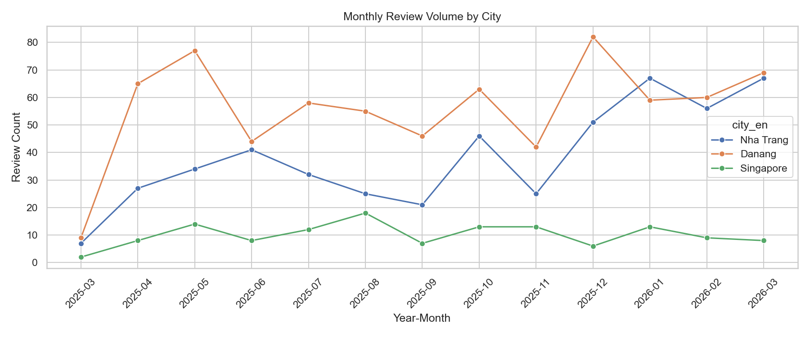
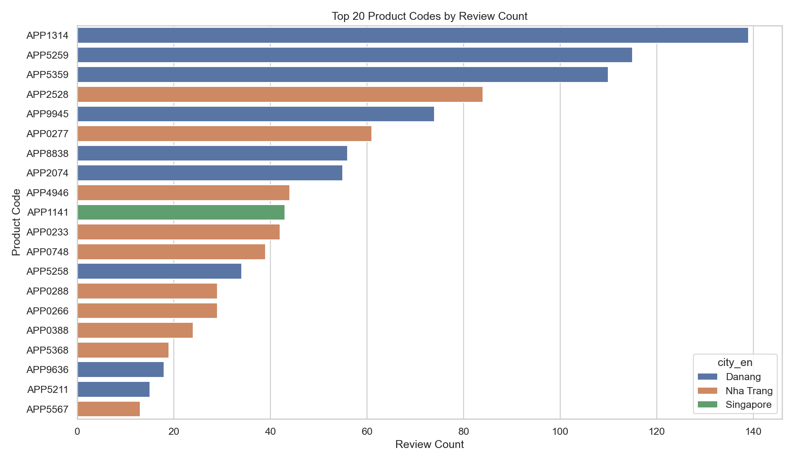
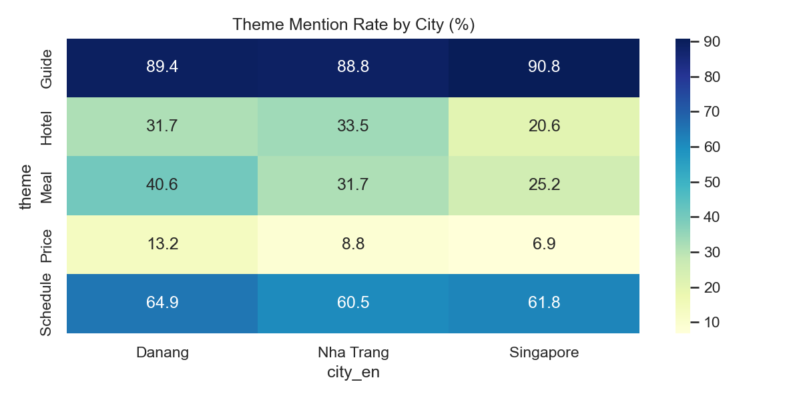
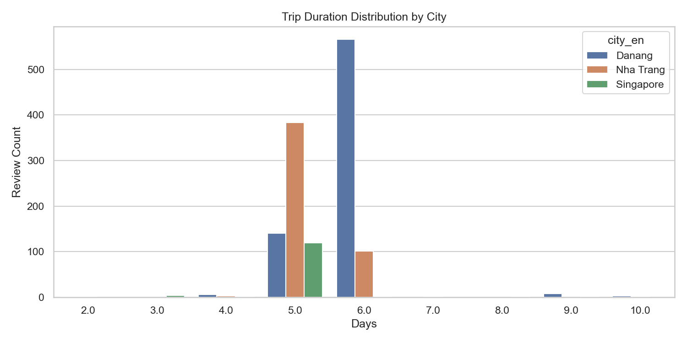

# 20260328 다낭/나트랑/싱가폴 통합 분석 리포트

- 작성일: 20260328
- 범위: 오늘 수행한 리뷰 수집/리뷰량/연령언급/비즈니스 지표/시각화 통합

## 1) 리뷰량 요약

| 도시 | 리뷰 수 | 점유율(%) | 월평균(건) | 최근 3개월(건) | 피크 월 | 피크 건수 |
|---|---:|---:|---:|---:|---|---:|
| 다낭 | 729 | 52.60 | 60.75 | 200 | 2025-12 | 82 |
| 나트랑 | 526 | 37.95 | 43.83 | 204 | 2026-03 | 72 |
| 싱가폴 | 131 | 9.45 | 10.92 | 30 | 2025-08 | 18 |

## 2) 연령 언급 분석(텍스트 기반)

- 주의: 실제 나이 컬럼이 아닌 리뷰 텍스트 내 연령 직접 언급(`20대`, `만 30세`)만 집계

### 2-1) 도시별 연령 언급 커버리지

| 도시 | 총 리뷰 | 연령 언급 리뷰 | 연령 언급 비중(%) |
|---|---:|---:|---:|
| 다낭 | 729 | 19 | 2.61 |
| 나트랑 | 499 | 18 | 3.61 |
| 싱가폴 | 131 | 3 | 2.29 |

### 2-2) 연령대별 언급 분포

| 도시 | 20대 | 30대 | 40대 | 50대 | 60대 | 70대 |
|---|---:|---:|---:|---:|---:|---:|
| 다낭 | 3 | 1 | 1 | 2 | 4 | 8 |
| 나트랑 | 4 | 1 | 0 | 2 | 3 | 8 |
| 싱가폴 | 1 | 0 | 0 | 0 | 1 | 1 |

## 3) 비즈니스 KPI 요약

| 도시 | 리뷰수 | 상품코드수 | 긍정언급률(%) | 부정언급률(%) | 평균 일정일수 |
|---|---:|---:|---:|---:|---:|
| 다낭 | 729 | 75 | 97.94 | 30.04 | 5.83 |
| 나트랑 | 499 | 60 | 96.79 | 26.65 | 5.22 |
| 싱가폴 | 131 | 31 | 95.42 | 25.95 | 5.02 |

## 4) 시각화

### 4-1) 월별 리뷰 추이

[원본 이미지 열기](business_analysis_outputs/viz_monthly_review_trend.png)

### 4-2) 상위 상품코드 TOP20

[원본 이미지 열기](business_analysis_outputs/viz_top_product_codes.png)

### 4-3) 테마 언급률 히트맵

[원본 이미지 열기](business_analysis_outputs/viz_theme_mentions_heatmap.png)

### 4-4) 일정 길이 분포

[원본 이미지 열기](business_analysis_outputs/viz_trip_duration_distribution.png)

## 5) 원본 지표 파일

- 리뷰량 요약: `reviews_volume_summary_3cities.csv`
- 연령 언급 커버리지: `reviews_age_mentions_coverage_3cities.csv`
- 연령 언급 분포: `reviews_age_mentions_summary_3cities.csv`
- 비즈니스 KPI: `business_analysis_outputs/biz_city_kpis.csv`
- 세부 분석 보고서: `business_analysis_outputs/비즈니스_추가지표_분석_0328.md`
