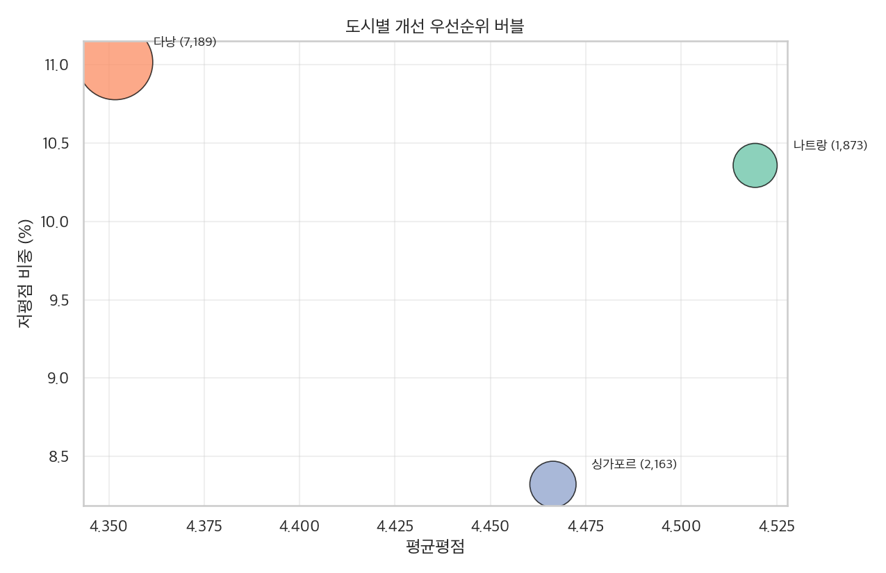
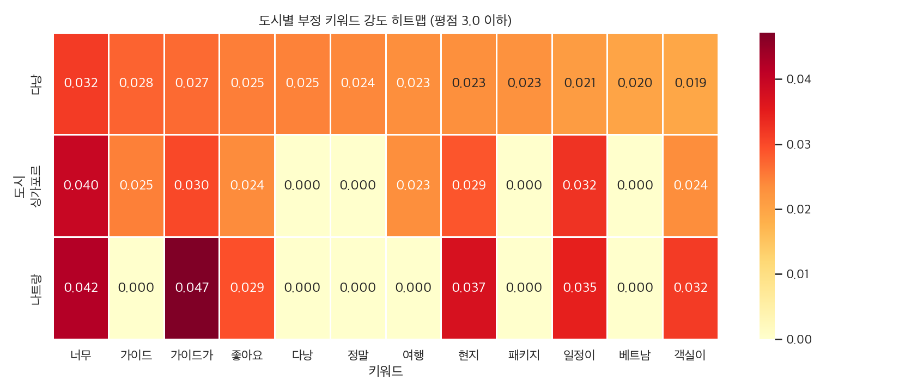
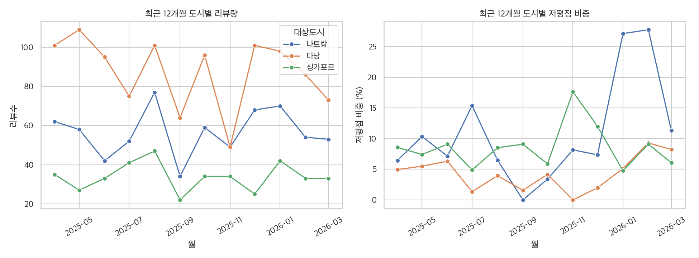

# 하나여행 리뷰 분석 보고서

- 생성시각: 2026-04-01 21:55:24
- 분석데이터: 하나여행/data/hanatour_reviews.csv
- 전체 리뷰수: 11,225건
- 도시 수: 3개
- 여행코드 수: 96개
- 리뷰 기간: 2011-09-07 ~ 2026-03-25

## 분석 목적

- 도시별 리뷰 데이터를 기반으로 고객이 반응하는 일정/상품코드/경험요소를 도출
- 리뷰량과 키워드 신호를 통해 상품 개선 우선순위를 정의
- 결과를 신규/개선 여행상품 기획(일정 설계, 운영 품질, 커뮤니케이션)에 반영

## 1) 도시별 리뷰량 현황

| 도시 | 리뷰수 | 리뷰비중 | 고유여행코드수 | 평균평점 |
| --- | --- | --- | --- | --- |
| 다낭 | 7,189 | 64.0% | 36 | 4.35 |
| 싱가포르 | 2,163 | 19.3% | 26 | 4.47 |
| 나트랑 | 1,873 | 16.7% | 34 | 4.52 |

## 2) 도시별 여행일정 분포

### 다낭 일정 분포 Top 5

| 여행일정 | 리뷰수 | 비중 |
| --- | --- | --- |
| 5일 | 5,631 | 78.3% |
| 4일 | 844 | 11.7% |
| 6일 | 272 | 3.8% |
| 3박4일 | 228 | 3.2% |
| 1일 | 121 | 1.7% |

### 싱가포르 일정 분포 Top 5

| 여행일정 | 리뷰수 | 비중 |
| --- | --- | --- |
| 5일 | 2,102 | 97.2% |
| 6일 | 14 | 0.6% |
| 1일 | 14 | 0.6% |
| 4일 | 13 | 0.6% |
| 3박5일 | 11 | 0.5% |

### 나트랑 일정 분포 Top 5

| 여행일정 | 리뷰수 | 비중 |
| --- | --- | --- |
| 5일 | 1,711 | 91.4% |
| 6일 | 107 | 5.7% |
| 1일 | 40 | 2.1% |
| 4일 | 10 | 0.5% |
| 미식별 | 4 | 0.2% |

## 3) 도시별 여행코드 반응(리뷰수 기준)

### 다낭 여행코드 Top 7

| 여행코드 | 리뷰수 | 평균평점 | 대표상품명(요약) |
| --- | --- | --- | --- |
| MAV1039 | 2,702 | 4.25 | [출발확정] 다낭 5일 #시내 4성호텔 #바나힐 테마파크 #호이안 #전신마사지 #캔... |
| MAV1040 | 1,549 | 4.24 | [출발확정] 다낭 5일 #윈덤 골든베이 #월드체인5성 #바나힐 테마파크 #호이안 #... |
| MAV1044 | 889 | 4.44 | [온라인 전용]다낭/호이안 5일▒4성호텔+1일자유+호이안 야간시티 투어▒ |
| MAV1041 | 819 | 4.58 | 다낭 5일 #시내중심 5성호텔 #바나힐 테마파크 #호이안 야경투어 #씨푸드 #루프탑... |
| MAV1045 | 622 | 4.48 | 다낭 5일 #윈덤 골든베이 #월드체인5성 #NO옵션 #바나힐 테마파크 #호이안 야경... |
| MAV1002 | 99 | 4.33 | 다낭 5일 #시타딘 펄 호이안 #슈페리어 #해변5성 #바나힐 테마파크 #호이안 #아... |
| MAV3005 | 85 | 4.56 | [우리끼리] 다낭 5일 #미카즈키 #패밀리룸 오션뷰 #워터파크 #온천 #호이안 야경... |

### 싱가포르 여행코드 Top 7

| 여행코드 | 리뷰수 | 평균평점 | 대표상품명(요약) |
| --- | --- | --- | --- |
| MAS1060 | 821 | 4.58 | [완전특가] 싱가포르 5일#1일자유#루지#슈퍼트리쇼#4성업그레이드 |
| MAS1012 | 452 | 4.58 | 싱가포르 5일#센토사 데이투어 #루지 #마담투소 #리버원더스 #4성호텔 |
| MAS1013 | 345 | 4.21 | 싱가포르 완전일주 5일-4성호텔 ▶가든렙소디+샹그릴라뷔페+루지+전일관광◀ |
| MAS1008 | 211 | 4.30 | 싱가포르 5일-4성호텔+마리나베이샌즈1박 ▶샹그릴라뷔페+루지+1DAY자유◀ |
| MAS1018 | 94 | 4.66 | [4인이상 출발 확정 ] 싱가포르  5일 #완전특가 #1일자유 #센토사루지 #슈퍼트... |
| MAS1061 | 68 | 4.59 | [출발확정] 싱가포르 5일 #완전특가 #전일관광 #에메랄드힐 #센토사섬 #슈퍼트리쇼... |
| MAS1062 | 46 | 4.61 | [출발확정] 싱가포르 5일#시내 4성호텔 #리버원더스 #핵심관광지 #1일 자유 #N... |

### 나트랑 여행코드 Top 7

| 여행코드 | 리뷰수 | 평균평점 | 대표상품명(요약) |
| --- | --- | --- | --- |
| MAV1333 | 858 | 4.47 | 나트랑/달랏 5일#위장을채워달랏#1일1간식#시내호텔#달랏야시장#랑비엔SUV탑승#핵심... |
| MAV1544 | 261 | 4.61 | [출발확정] 나트랑/달랏 5일 #구름위의 힐링여행 #나트랑1박 오션뷰 #랑비엔고원S... |
| MAV1546 | 233 | 4.74 | 스타가이드와 함께하는 나트랑/달랏 5일 #더듬뿍바다달랏 #전일정5성급 호텔 #MD추... |
| MAV1580 | 81 | 4.56 | [스마트초이스] 나트랑/달랏 5일 #럭셔리해달랏 #전일정5성급 #달랏팰리스 2박 #... |
| MAV1243 | 71 | 4.62 | 나트랑 자유여행 5일[멜리아빈펄엠파이어/디럭스] #시내5성 #호텔조식 # 빈원더스 ... |
| MAV1289 | 47 | 4.68 | 나트랑 자유여행 5일[셀렉텀/프리미어 디럭스] #깜란지역 #신상호텔 #올인클루시브 |
| MAV1323 | 41 | 4.24 | 나트랑 5일 #5성급호텔 #호핑투어 #판랑사막관광 #판랑지프차 #3대특식 #나트랑시... |

## 4) 리뷰 키워드 분석

- 리뷰요약: 고객이 선택한 구조화 문구 기반
- 리뷰본문: 자유서술 내용에서 상위 토큰 추출

### 다낭 키워드

- 리뷰요약 기반 상위 키워드

| 키워드 | 언급수 |
| --- | --- |
| 일정이 알차요 | 1,841 |
| 객실이 깨끗해요 | 1,508 |
| 가이드가 배려 깊고 세심해요 | 1,471 |
| 가격이 합리적이에요 | 1,452 |
| 현지 음식이 맛있어요 | 1,389 |
| 가이드가 전문적이에요 | 1,247 |
| 가이드가 열정적이에요 | 729 |
| 호텔 부대시설이 좋아요 | 679 |
| 가격만큼 가치 있어요 | 667 |
| 호텔이 관광지와 가까워요 | 616 |

- 리뷰본문 기반 상위 토큰

| 토큰 | 빈도 |
| --- | --- |
| 많이 | 1,935 |
| 베트남 | 1,760 |
| 좋은 | 1,660 |
| 여행을 | 1,636 |
| 덕분에 | 1,500 |
| 즐거운 | 1,484 |
| 감사합니다 | 1,266 |
| 좋았습니다 | 1,172 |
| 함께 | 1,088 |
| 현지 | 992 |

### 싱가포르 키워드

- 리뷰요약 기반 상위 키워드

| 키워드 | 언급수 |
| --- | --- |
| 일정이 알차요 | 867 |
| 가이드가 전문적이에요 | 644 |
| 객실이 깨끗해요 | 569 |
| 현지 음식이 맛있어요 | 510 |
| 가격이 합리적이에요 | 471 |
| 가이드가 배려 깊고 세심해요 | 430 |
| 가이드가 열정적이에요 | 342 |
| 가격만큼 가치 있어요 | 331 |
| 호텔이 관광지와 가까워요 | 284 |
| 현지 음식이 다양해요 | 275 |

- 리뷰본문 기반 상위 토큰

| 토큰 | 빈도 |
| --- | --- |
| 많이 | 495 |
| 덕분에 | 476 |
| 좋은 | 439 |
| 좋았습니다 | 375 |
| 여행을 | 374 |
| 즐거운 | 374 |
| 싱가폴 | 345 |
| 감사합니다 | 334 |
| 여행이었습니다 | 281 |
| 함께 | 272 |

### 나트랑 키워드

- 리뷰요약 기반 상위 키워드

| 키워드 | 언급수 |
| --- | --- |
| 일정이 알차요 | 834 |
| 가격이 합리적이에요 | 826 |
| 현지 음식이 맛있어요 | 794 |
| 객실이 깨끗해요 | 792 |
| 가이드가 배려 깊고 세심해요 | 679 |
| 가이드가 전문적이에요 | 576 |
| 가이드가 열정적이에요 | 338 |
| 현지 음식이 다양해요 | 329 |
| 호텔이 시내에 있어요 | 313 |
| 일정이 여유로워요 | 307 |

- 리뷰본문 기반 상위 토큰

| 토큰 | 빈도 |
| --- | --- |
| 많이 | 418 |
| 달랏 | 376 |
| 덕분에 | 346 |
| 여행을 | 334 |
| 베트남 | 312 |
| 좋은 | 309 |
| 즐거운 | 276 |
| 함께 | 253 |
| 좋았습니다 | 237 |
| 감사합니다 | 225 |

## 5) 최근 12개월 월별 리뷰량

| 월 | 나트랑 | 다낭 | 싱가포르 | 합계 |
| --- | --- | --- | --- | --- |
| 2025-04 | 62 | 101 | 35 | 198 |
| 2025-05 | 58 | 109 | 27 | 194 |
| 2025-06 | 42 | 95 | 33 | 170 |
| 2025-07 | 52 | 75 | 41 | 168 |
| 2025-08 | 77 | 101 | 47 | 225 |
| 2025-09 | 34 | 64 | 22 | 120 |
| 2025-10 | 59 | 96 | 34 | 189 |
| 2025-11 | 49 | 49 | 34 | 132 |
| 2025-12 | 68 | 101 | 25 | 194 |
| 2026-01 | 70 | 98 | 42 | 210 |
| 2026-02 | 54 | 86 | 33 | 173 |
| 2026-03 | 53 | 73 | 33 | 159 |

## 6) TF-IDF 기반 긍정/부정 키워드 분석

- 기준: 평점 4.5 이상=긍정, 3.0 이하=부정
- 방법: 리뷰요약+리뷰본문 텍스트 TF-IDF 벡터화 후 클래스 평균 가중치 차이(긍정-부정) 계산

### 전체 긍정 대표 키워드

| 키워드 | 긍정우세점수 |
| --- | --- |
| 가이드가 | 0.0273 |
| 알차요 | 0.0234 |
| 일정이 알차요 | 0.0234 |
| 배려 | 0.0218 |
| 깊고 | 0.0212 |
| 가이드님 | 0.0212 |
| 배려 깊고 | 0.0211 |
| 가이드가 배려 | 0.0211 |
| 세심해요 | 0.0211 |
| 깊고 세심해요 | 0.0211 |
| 알차요 현지 | 0.0199 |
| 전문적이에요 | 0.0197 |

### 전체 부정 대표 키워드

| 키워드 | 부정우세점수 |
| --- | --- |
| 선택관광 | 0.0185 |
| 그냥 | 0.0165 |
| 다른 | 0.0143 |
| 가이드 | 0.0129 |
| 가이드는 | 0.0109 |
| 하나투어 | 0.0103 |
| 선택관광을 | 0.0101 |
| 패키지 | 0.0101 |
| 다시는 | 0.0099 |
| 마지막날 | 0.0089 |
| 없는 | 0.0088 |
| 선택 | 0.0086 |

### 도시별 부정 키워드 (평점 3.0 이하 리뷰)

#### 다낭

| 키워드 | 평균TF-IDF |
| --- | --- |
| 너무 | 0.0317 |
| 가이드 | 0.0275 |
| 가이드가 | 0.0268 |
| 좋아요 | 0.0249 |
| 다낭 | 0.0247 |
| 정말 | 0.0241 |
| 여행 | 0.0233 |
| 현지 | 0.0231 |

#### 싱가포르

| 키워드 | 평균TF-IDF |
| --- | --- |
| 너무 | 0.0397 |
| 일정이 | 0.0325 |
| 가이드가 | 0.0300 |
| 현지 | 0.0289 |
| 호텔 | 0.0274 |
| 호텔이 | 0.0266 |
| 가이드 | 0.0248 |
| 좋아요 | 0.0238 |

#### 나트랑

| 키워드 | 평균TF-IDF |
| --- | --- |
| 가이드가 | 0.0472 |
| 너무 | 0.0422 |
| 현지 | 0.0372 |
| 일정이 | 0.0347 |
| 음식이 | 0.0344 |
| 현지 음식이 | 0.0330 |
| 깨끗해요 | 0.0317 |
| 객실이 | 0.0317 |

## 7) 코사인 유사도 기반 유사 리뷰 페어

- 방법: 도시별 최신 리뷰(최대 1,800건) TF-IDF 벡터화 후 최근접 이웃(코사인) 탐색
- 활용: 중복 VOC(동일 불만/동일 칭찬) 묶음 탐지 및 개선과제 우선순위화

### 다낭 유사 리뷰 Top 5

| Similarity | ReviewID-1 | ReviewID-2 | 요약1 | 요약2 |
| --- | --- | --- | --- | --- |
| 1.0000 | 306642 | 268938 | 객실이 깨끗해요, 호텔이 관광지와 가까워요, 호텔에서 쉬기 좋아요, 객실 | 객실이 깨끗해요, 호텔이 관광지와 가까워요, 호텔에서 쉬기 좋아요, 객실 |
| 0.9384 | 302824 | 302668 | 객실이 깨끗해요, 일정이 알차요, 식당이 청결해요, 가격만큼 가치 있어요 | 객실이 깨끗해요, 일정이 알차요, 가이드가 열정적이에요, 식당이 청결해요 |
| 0.8984 | 306642 | 269856 | 객실이 깨끗해요, 호텔이 관광지와 가까워요, 호텔에서 쉬기 좋아요, 객실 | 객실이 깨끗해요, 호텔이 관광지와 가까워요, 호텔에서 쉬기 좋아요, 객실 |
| 0.8436 | 284168 | 269942 | 호텔이 시내에 있어요, 일정이 알차요, 현지 음식이 다양해요, 가격이 합 | 호텔이 시내에 있어요, 일정이 알차요, 현지 음식이 다양해요, 가격이 합 |
| 0.8329 | 308181 | 305847 | 객실이 깨끗해요, 일정이 여유로워요, 현지 음식이 맛있어요, 가격이 합리 | 객실이 깨끗해요, 일정이 여유로워요, 현지 음식이 맛있어요, 가격이 합리 |

### 싱가포르 유사 리뷰 Top 5

| Similarity | ReviewID-1 | ReviewID-2 | 요약1 | 요약2 |
| --- | --- | --- | --- | --- |
| 1.0000 | 258866 | 236679 | 객실이 깨끗해요, 일정이 알차요, 식당이 청결해요, 가격만큼 가치 있어요 | 객실이 깨끗해요, 일정이 알차요, 식당이 청결해요, 가격만큼 가치 있어요 |
| 0.9666 | 298820 | 298834 | 객실이 깨끗해요, 일정이 여유로워요, 현지 음식이 다양해요, 가격이 합리 | 객실이 깨끗해요, 일정이 여유로워요, 현지 음식이 다양해요, 가격만큼 가 |
| 0.8073 | 275567 | 263132 | 객실이 깨끗해요, 일정이 알차요, 현지 음식이 맛있어요, 가격이 합리적이 | 객실이 깨끗해요, 일정이 알차요, 현지 음식이 맛있어요, 가격이 합리적이 |
| 0.7623 | 260582 | 230112 | 객실이 깨끗해요, 일정이 알차요, 현지 음식이 맛있어요, 가격이 합리적이 | 일정이 알차요, 현지 음식이 맛있어요, 가격이 합리적이에요, 가이드가 전 |
| 0.7442 | 267115 | 263582 | 호텔이 관광지와 가까워요, 즐길 거리가 다양해요, 현지 음식이 다양해요, | 호텔이 관광지와 가까워요, 즐길 거리가 다양해요, 현지 음식이 다양해요, |

### 나트랑 유사 리뷰 Top 5

| Similarity | ReviewID-1 | ReviewID-2 | 요약1 | 요약2 |
| --- | --- | --- | --- | --- |
| 0.9428 | 252294 | 252296 | 일정이 알차요, 현지 음식이 다양해요, 가격만큼 가치 있어요 | 즐길 거리가 다양해요, 현지 음식이 맛있어요, 가격만큼 가치 있어요 |
| 0.8828 | 296375 | 261869 | 객실이 깨끗해요, 일정이 알차요, 현지 음식이 맛있어요, 가격만큼 가치  | 객실이 깨끗해요, 일정이 알차요, 현지 음식이 맛있어요, 가격만큼 가치  |
| 0.8180 | 305491 | 235350 | 객실이 깨끗해요, 일정이 알차요, 현지 음식이 맛있어요, 가격이 합리적이 | 객실이 깨끗해요, 일정이 알차요, 현지 음식이 맛있어요, 가격이 합리적이 |
| 0.8002 | 305491 | 256128 | 객실이 깨끗해요, 일정이 알차요, 현지 음식이 맛있어요, 가격이 합리적이 | 객실이 깨끗해요, 일정이 알차요, 현지 음식이 맛있어요, 가격이 합리적이 |
| 0.7946 | 305491 | 277628 | 객실이 깨끗해요, 일정이 알차요, 현지 음식이 맛있어요, 가격이 합리적이 | 객실이 깨끗해요, 일정이 알차요, 현지 음식이 맛있어요, 가격이 합리적이 |

## TF-IDF/유사도 기반 추가 인사이트

- 긍정 키워드와 부정 키워드의 분리도가 높은 항목은 상품 상세페이지 메시지와 운영 KPI의 핵심 후보입니다.
- 도시별 부정 키워드는 지역 특화 개선과제(예: 이동 동선, 식사, 가이드 운영)를 설계하는 근거로 사용할 수 있습니다.
- 코사인 유사 리뷰 페어는 VOC를 테마 단위로 묶어, 건별 대응이 아닌 묶음 대응(템플릿 개선)에 활용 가능합니다.

## 8) 개선포인트 시각화

### 도시별 개선 우선순위 버블

- 우상단(저평점 비중 높고 평점 낮음)으로 갈수록 우선 개선 필요

### 도시별 부정 키워드 히트맵

- 도시마다 강하게 나타나는 부정 신호 키워드를 빠르게 비교

### 월별 리뷰량/저평점 비중 추이

- 특정 월 급증한 저평점 구간을 찾아 운영 이슈 시점과 연결 분석

## 비즈니스 인사이트

- 리뷰 볼륨은 다낭에 집중되어 있으며 비중은 64.0%입니다. 해당 도시는 상품 개선 실험(A/B) 우선 적용 후보입니다.
- 평균 평점은 나트랑이(가) 가장 높고(4.52), 고평점 구조를 다른 도시 상품 기획에 이식할 여지가 있습니다.
- 리뷰요약에서는 '일정 알참/가이드 품질/객실 청결/현지 음식' 요소가 반복적으로 확인되어, 판매 페이지 핵심 메시지로 활용 가치가 높습니다.
- 여행코드별 리뷰 쏠림이 커서, 상위 코드의 강점을 템플릿화해 중하위 코드로 확산하면 상품 포트폴리오 전체 전환 개선이 가능합니다.

## 개선된 여행상품 개발 제안

- 일정 설계: 도시별 주력 일정(예: 5일) 중심으로 핵심 동선을 표준화하고, 선택옵션은 피로도 낮은 모듈형으로 재구성
- 가이드 운영: 리뷰 상위 여행코드의 가이드 운영 방식(설명 밀도, 케어 방식, 사진 지원)을 운영 매뉴얼로 문서화
- 숙소/식사: '객실 청결', '현지 음식' 키워드가 높은 상품은 프리미엄 라인으로, 낮은 상품은 협력사 SLA 재협상
- 리뷰 KPI: 도시-여행코드 단위로 월간 리뷰량, 평점, 핵심 키워드 언급률(일정/가이드/객실/음식)을 대시보드 지표로 관리
